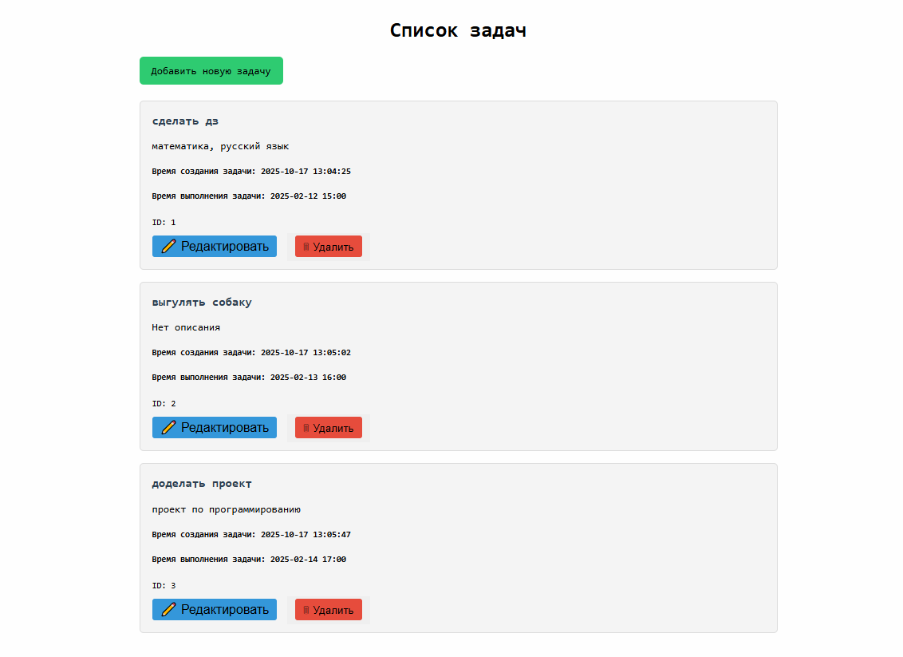

# Список задач с использованием fastAPI

<p align="center">

</p>

Данный проект представляет собой список задач который реализуется с помощью fastAPI, sqlite 3, html, css
# Функционал

- добавление задач  
- редактирование задач
- удаление задач
# Формат задач
- название задачи
- описание задачи
- время выполнение задачи
- время создания задачи
# Структура проекта
```commandline
├── main.py                   # основной файл
├── db_helper.py              # файл для создания базы данных
├── db.db                     # база данных
├── static/                   # статические файлы
└── templates/                # шаблоны html страниц
```
# Источники

1. [FastAPI](https://fastapi.tiangolo.com/)
2. [Python](https://docs.python.org/)
3. [SQlite](https://docs.sqlalchemy.org/)
